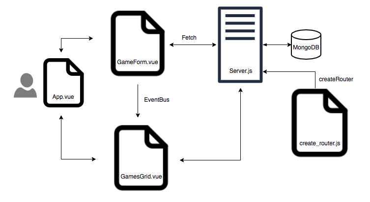

What is responsible for defining the routes of the games resource?

```
create_router.js
```

What do you notice about the folder structure? Whats the client responsible for? Whats the server responsible for?

```
The server is responsible for routing CRUD functionality to the database, while the client is responsible for handling user interaction and passing instructions to server
```

What are the the responsibilities of server.js?

```
server.js uses a helper file to route requests between client and database
```

What are the responsibilities of the gamesRouter?

```
gamesRouter is responsible for listening for requests from the client and passing them to the database
```

What process does the the client (front-end) use to communicate with the server?

```
fetch
```

What optional second argument does the fetch method take? And what is it used for in this application? Hint: See Using Fetch on the MDN docs

```
fetch takes an object as its second argument which contains information that the server needs to know in order to carry out its request
```

Which of the games API routes does the front-end application consume (i.e. make requests to)?

```
create - post('/')
read - get('/')
delete - delete('/:id')
```

What are we using the MongoDB Driver for?

```
these drivers allow node.js to interact with MongoDB
```

Why do we need to use ObjectId from the MongoDB driver?

```
ObjectID is a pointer to the location of that object in memory. This allows for an object's location to be searched, rather than a specific parameter within the object.
```
